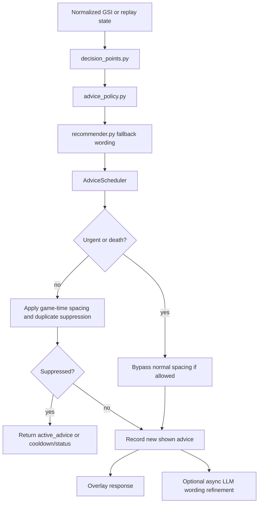

# Advice Scheduler

`backend/app/advice_scheduler.py` is the in-memory anti-spam and display state layer between decision detection and the overlay.

It does not parse Dota data, choose hero builds, call STRATZ, read the screen, read memory, or automate input. It receives a normalized state plus a decision point and returns one of:

- a new advice card;
- the still-active previous advice card;
- a compact cooldown/status response.

## Flow

## Main Responsibilities

- Track match/session resets.
- Count full advice cards separately from status/monitoring responses.
- Keep the last useful card visible while cooldown is active.
- Suppress repeated category/action advice.
- Enforce game-time spacing for normal coaching advice.
- Let urgent safety advice interrupt normal coaching spacing when appropriate.
- Pin death review advice while dead/respawning.
- Suppress repeated low-HP, objective, and post-laning macro messages.
- Record metrics for simulation reports and defense review.

## Game-Time Vs Wall-Clock

Decision frequency is based on Dota `game_time` or simulated replay `timestamp_seconds` when available. This matters because replay demos can run at `speed 5`, `speed 10`, or faster, but advice should still feel paced for real gameplay.

Wall-clock time is still used for:

- overlay card visibility/auto-hide;
- HTTP polling;
- async LLM staleness checks.

## Anti-Spam Rules

- Normal coaching advice is spaced by game time, typically at least 45-60 seconds apart.
- Same category/action advice is suppressed for about 120 seconds of game time.
- Objective caution is suppressed for about 150-180 seconds unless context changes meaningfully.
- Post-laning macro cards are suppressed after recent low-HP/death/safety advice.
- Monitoring/status responses do not increment `advice_count`.

## Urgent Interrupt Rules

`LOW_HP` and death review decisions may interrupt normal spacing. Repeated `LOW_HP` states are still grouped into episodes so the overlay does not spam the same urgent warning every few seconds.

## Active Advice

Display hold is separate from advice generation. The backend may return `active_advice` during cooldown so the overlay can keep showing the previous useful card without counting it as a new card.

## Known Limitations

- The scheduler only uses signals available in the normalized state.
- It cannot know exact enemy positions, nearby allies/enemies, or team readiness unless those signals are provided.
- Replay-derived GSI-like states may miss cooldowns, spendable gold, and exact objective context.
- The scheduler is intentionally in-memory for the coursework MVP.
